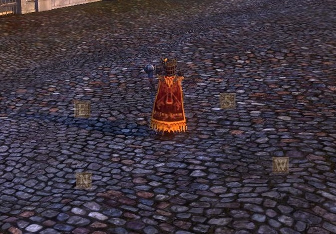

# Compass3D

VIDEO LINK: https://i.imgur.com/bJ706zB.mp4

This add-on overlays a "compass" that moves as you turn the camera. I created it ages ago and then forgot about it. Most of the magic is in "Source\Camera.lua" as that is what works out how to find the player's X, Y and Z position. X and Y (east-west and north-south) are determined by hooking into UI events that give the zone coordinates and then using an internal database (in "Source\ZoneData.lua") to convert the zone coordinates into world coordinates. The Z (height in WAR's case) coordinate is special...

There is no official way to get this, but there does exist a function that converts world coordinates to a point on the screen. We also know that the middle of the screen is the point the camera pivots around. Based on this, we do a scan of all the Z coordinates (X and Y have already been worked out) until we find the XYZ combination that is in the middle of the screen.

This would cause a load of stuttering if calculated via brute force so instead it is divided up into two phases: the coarse and the fine search. The coarse search checks large intervals of Z increments (50 inches) until it finds the Z value (in multiples of 50 inches) that is closest to the middle of the screen. The maximum number of checks would be 1310, but it is typically much less than this as the maps are not situated at the highest point in the "world". It then moves on the fine search phase.

The fine search phase now does a similar thing as the coarse search phase but with increments of one inch until it fines the Z point closest to the middle of the screen. This is typically either exactly correct or 1-2 pixels off depending on zoom level. At this point the rotation point of the camera has been determined as accurately as we need and the 4 compass points can be positioned on screen in the "world" where they move and rotate correctly.

The final optimisation is that once the Z point has been found once, we do not have to keep doing the big scan each frame. For subsequent frames that Z point is used as the starting point (assuming it is on screen) and immediately moves onto the fine phase. This final optimisation phase is known as the "historic" phase in the code. Only a single frame needs to do the full check and then all subsuquent frames just recalculate and only need to do a handful of checks. If you zoom in too far then the Z position cannot be found (especially in first person mode), at which point the compass is hidden. When you zoom out there will be one frame where the coarse search needs to be completed again.

## Bugs

1) There is very tiny jitter due to it only checking down to the inch level.
2) Due to what I assume is a bug in the client, the UI events that broadcast the player's X and Y position does not update correctly when you are in the air or moving backwards. This means the camera will appear to lag behind during this. Sometimes the client fixes itself, sometimes you need to take a step forward or strafe for it to fix. Nothing I can do about this one!
3) If new zones are added, the addon won't be able to understand them so you will need to update the info in "Source\ZoneData.lua". It might not have all of the ROR zones listed at this time.

## Settings

This add-on has no interface to change the settings as I'm just releasing it to show what is possible. If you want to tweak things then open up "Source\Compass3D.lua" fine and take a look at the 3 variables at the top: `compass_windows` to configure what each of the 4 points look like (you can also add more points at different positions), `compass_offset_feet` to configure how far below the pivot point (top of player's head) the compass is centered on. Gobbos and stunties will want a smaller value, and `compass_radius_feet` to change how far the points are from the player.

## Support

This add-on is abandoned, use it at your own risk and don't expect any updates. Feel free to play with the code and make something more useful out of it.